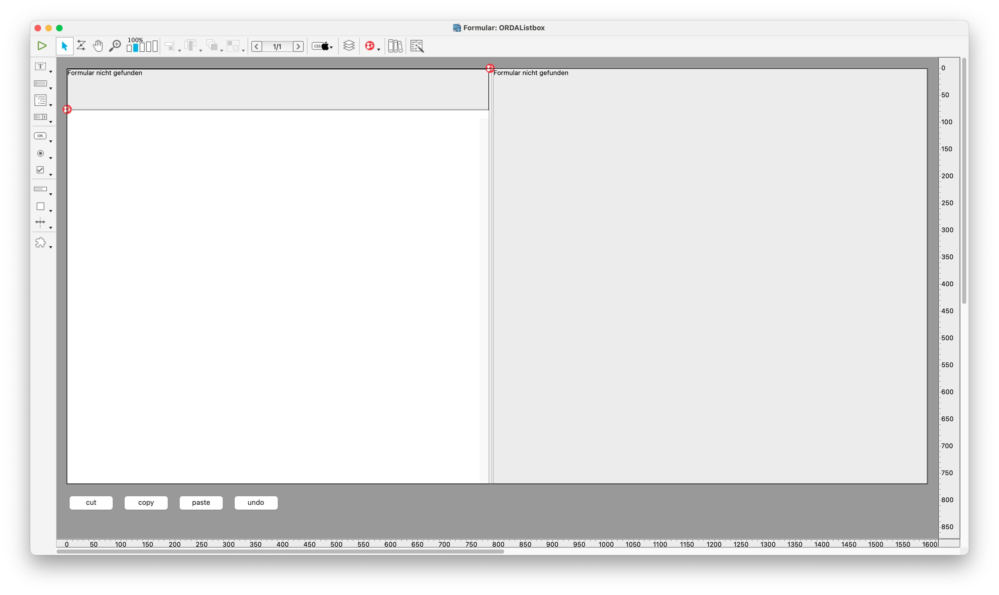

# Integration

## Overview

This form combines the listbox, the preview (subform on the right) and the toolbar (subform on top).

The toolbar is handled through the class "Toolbar" and "Toolbar_Button" (each button is an instance of Toolbar_Button, together they build an instance of Toolbar).
The class Toolbar_Setup is only used by the toolbar editor.

The list box is handled through the class "ORDA_Listbox".

Invoice printing is done through "Helper_Invoices"

The class "FieldListEditor" is needed for the field list in reporting with 4D View Pro.

Using ORDA classes allows to add computed attributes, Aliases (to ease the access to related fields) and to overwrite listbox functionality.

## List box

The list box needs the list box elements, with assigned attributes such as selected element (all using Form), using the class ORDA_Listbox and the form method to initialize. Copy and customize also the project method ORDA_Listbox_Method.

Without user settings it will display the first 10 fields for a table.
The user can modify them, saved settings are stored in the local logs folder (per user).

The field list includes besides "real" fields aliases and computed attributes.
As example see class CLIENTSEntity attribute TotalSales or INVOICESEntity attribute CustomerName.
Provide Computed Attributes for all kind of business numbers you do not store as real values in your structure.

## Toolbar

The Toolbar needs the form Toolbar_setup (if you want to allow customized toolbars), the classes Toolbar, Toolbar_Button and Toolbar_Setup and the project method ORDA_Listbox_Method. The example toolbar uses icons from Resources/Images/Buttons_32 and Buttons_16 (normal and small buttons).

The toolbar is build "on the fly" as dynamic form and displayed in the topmost subform. 
The default buttons are stored in a text file named "Default.json", stored in Resources/Settings/Toolbar.
To overwrite the default buttons - or allow the end user to create a customized list, open form "Toolbar_Setup.

Handling a button click is divided in two parts, generic and custom actions.
Generic actions are handled in ORDA_Listbox.handleButtonClick(), while custom actions handled in project method ORDA_Listbox_Method.

#### Standard Actions
Actions such as All, None, Selected, Query, etc, are handled in a generic way, allowing you to overwrite behavior if needed.‚‘

To overwrite, create a class  function with a given name. The code checks if that function exists, if yes it is executed, else a generic function is used.

Examples:
CLIENTS.useAll: execute ds.CLIENTS.all() followed by an order by Name, as customers should be sorted by name per default. You might want to show newest invoices or only unpaid invoices.

CILENTS.quickSearch: overwrite the standard search. Runs a search by Name, email or City, sort the result by name.

CLIENTS.calcWindowTitle: Overwrite the window title from ### of ### to "### clients out of xxx" (while clients out of is a localized string)

INVOICES.OverWriteButtonPopup: Overwrite 2nd level buttons, here the printing button to add several additional printing options.

## Preview
Subform on the right, used to display an ORDA prepared input form, such as [CLIENTS]Input_ORDA
The form is called with the selected entity/record passed in Form.data
Saving changes is handled from the object method of the list box container.

## Invoice Printing

Invoices, which can be designed using the invoice editor, can be printed for the customer in color, duplex, with conditions on the back of the first page, as internal copy (black/white, no background image, no business paper, no conditions) or exported as PDF directly to disk. When written as PDF a PDF/A is created, if country is Germany or France a Factur-X/Zugferd electronic invoice is created.

The class Helper_Invoice provides functions for this job, especially print_color(), print_white(), createPDF_noConditions() and createPDF().
In createPDF() define the target country (French/German/other).
It uses the function buildXML() to create the electronic invoice, which you need to adapt to your field names, to use it in your own application.

Find example calls in method "ORDA_Listbox_Method", search for "New Invoice as PDF":
<code>
			: ($classname="New Invoice as PDF")
				$context:={invoice: Form.SelectedElement; seller: Storage.company}
				$helper:=cs.Helper_Invoices.new($context)
				$helper.createPDF(System folder(Desktop)+"test.pdf")
</code>

## Invoice Editor
The functionality invoice editor uses the form "Invoice_Editor", the table "Document_Templates", the class "Helper_Invoices" and the file "Resources/EditorTemplates/Invoice_Fieldlist.txt". To create electronic invoices it also needs the folder "Resources/Profiles".

In table Document_Tables the editor allows to create/edit 3 documents. "Invoice", which contains the 4D Write Pro template to print an invoice. "BusinessPaper", which is used as background for the invoice and "Conditions", used for small prints as last page. Both BusinessPaper and Conditions are 4D Write Pro documents, but stored as SVG image to be inserted in the final invoice.

## Report

4D View Pro as report editor uses the class FieldListEditor with the project form "FieldListORDA" to provide the field list.
Additionally it uses the project form "ViewProReport" as an example form, with the two project methods VPReportCallback and VPReportUpdate

## Possible ideas for R5
rewrite ds.flatten to singleton 
use window type without toolbar