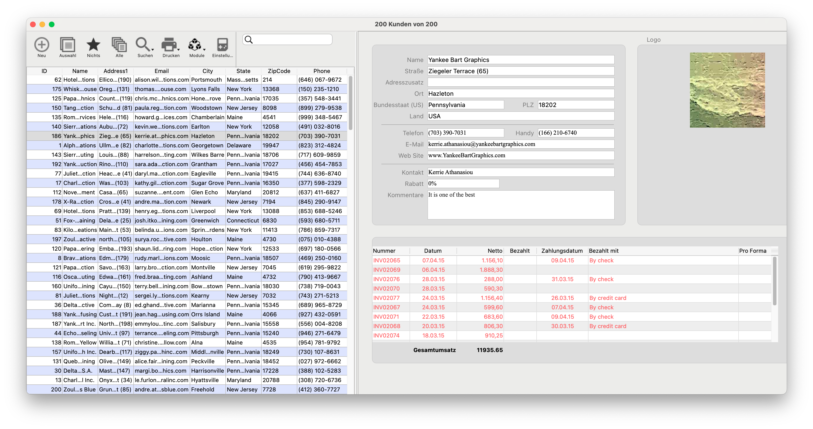
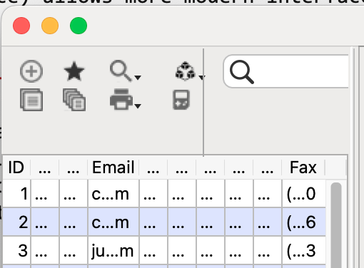
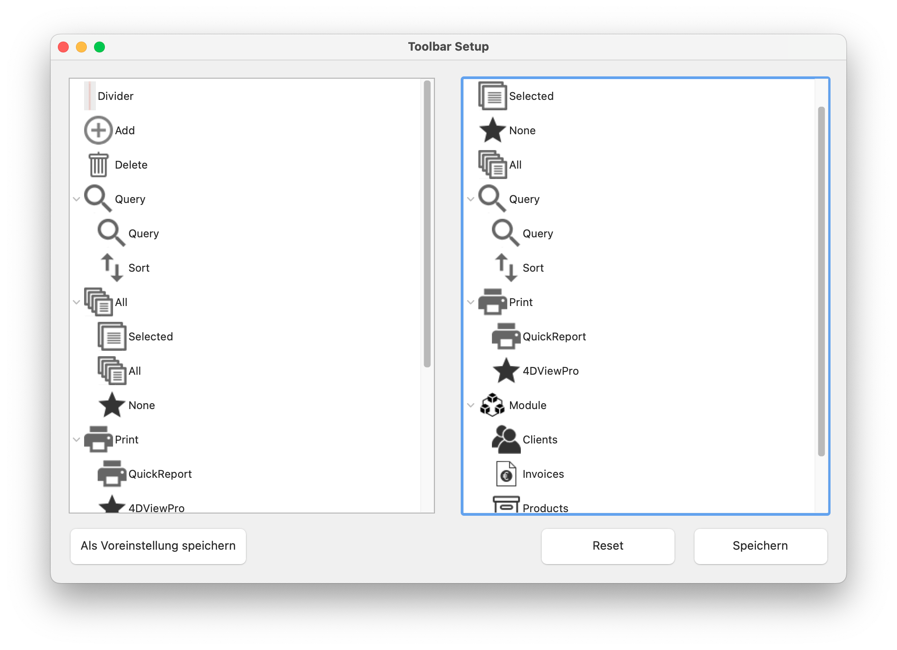
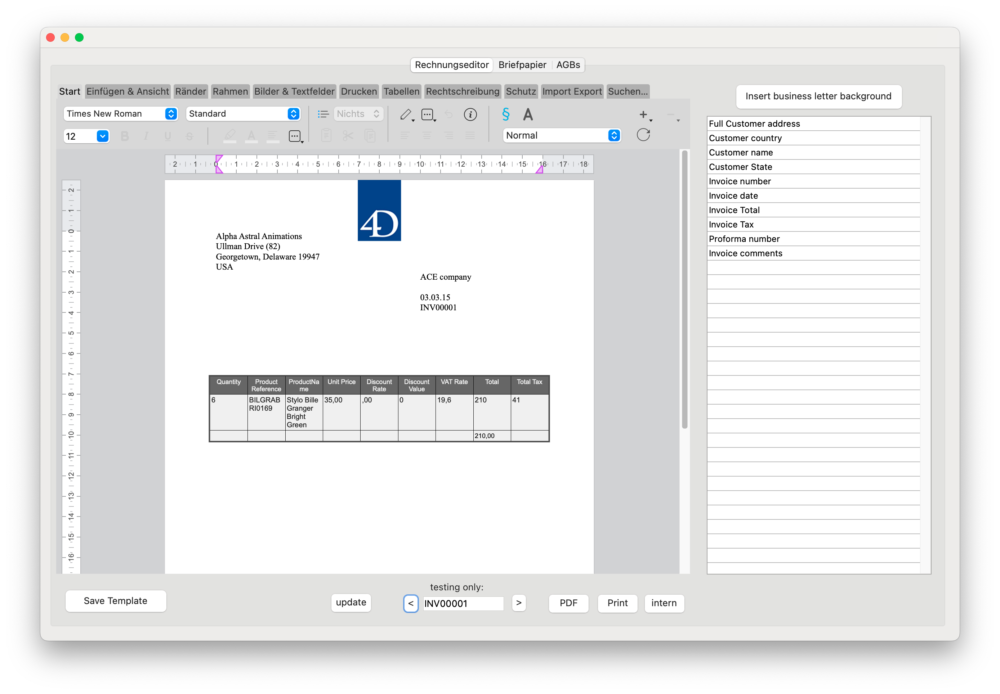
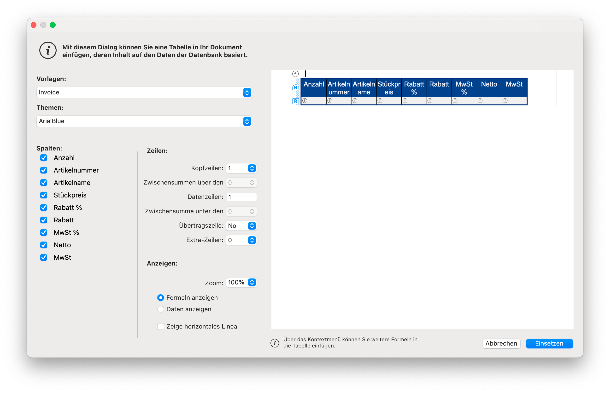
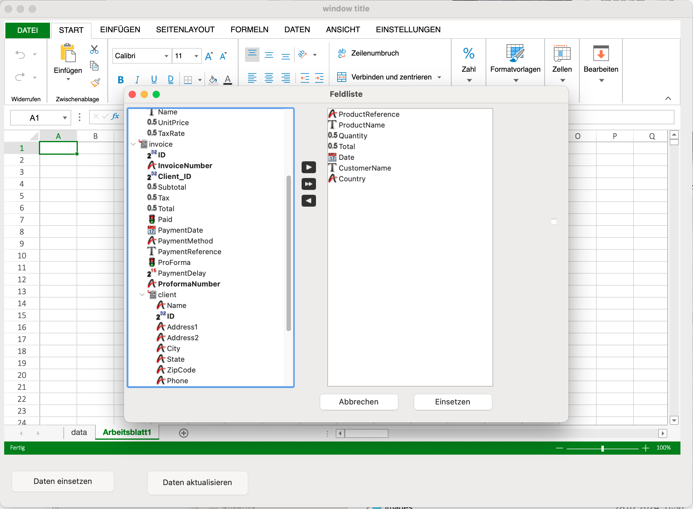

# EA_Invoices
A ready to use Invoice application. You can adapt it to suit your needs.

## History
There were several invoice examples created with 4D in the last 30 years, with the last one fully rewritten to use ORDA.

This one, based on a version created for 4D 14, before ORDA was introduced, shows:

- how to benefit with a classic application with minimal changes from ORDA features
- usage as SDI application on Windows
- generic list box to browse data with modifable preview of detail data, customizable
- optimistic locking
- generic toolbar/button bar to replace menu bar (for better SDI interface), customizable
- printing invoices via smart templating on paper or PDF, including electronic invoicing (Facture-X/Zugferd)
- invoice editor (allow the end user to modify invoice design/content)
- Reporting via 4D View Pro

## Feature Details

### SDI on Windows

SDI (Single Document Interface) allows more modern interfaces on Windows instead of MDI mode. 
[Read more in Blog post](https://blog.4d.com/4d-introduces-sdi-mode-for-applications-on-windows/)

The challenge designing SDI applications is how to handle the menu bar. While 4D automatically displays a menu bar for each window to allow easy migration from MDI mode, it is not the best design choice. By using a generic toolbar library, this example handles the whole interface using buttons, not needing a menu bar at all, similar to Microsoft Office on Windows.

### How to benefit with a classic application with minimal changes from ORDA features

Rewriting an existing 4D application from classic mode to ORDA provides many new possibilities, enhancing the feature set and performance of an application drastically. 
Lacking enough time or resources makes a total rewrite for many just being a dream, impossible to do beside normal work.
This example shows how to rewrite just the "main" interface part (output mode), while keeping the input forms, which usually contains most of the business logic and so most of the development work, untouched. As result the workload is low, but as users often spend most of their time in this mode, it enhance both user experience and reduce network load.

### Generic list box to browse data with modifable preview of detail data, customizable

Main part of the user interface is a list box, giving an overview of the data.
The columns in the list box can be pre-selected from the admin, while every user can add/remove columns, sort or change their width. 
Clicking the header change the sorting, header also allows to change the width or using drag&drop to rearrange the columns. Right click in the header allows to remove or add columns, as well as to save the changes.

Selecting a record displays detail data on the right side in a kind of preview form.
Idea is to use your current input form, change field data sources to ORDA, keep only the main page (remove additional pages), and remove all "complicated" (and usually rarely used) elements. Add whats quick to do, and remove time consuming elements, waiting for end user demands, with the target to do a quick conversion.

The detail form allows user entry/modifications.

### Optimistic locking

When the user modifies field content and select another record, the interface ask if you want to save the changes. If yes, it uses ORDA's auto merge feature. In most cases this works even if several users modifies the same record in parallel.
If there is a conflict or the record is locked through pessimistic locking (classic mode), an alert is displayed.

### Generic toolbar/button bar to replace menu bar 

The area above the list box is used to display a toolbar, including buttons and a search box. When the user reduces the width of the list box (using the splitter between list box and preview), the button sizes change. First the title is removed, then the buttons are displayed as smaller buttons:

The settings dialog (use the settings button) includes a Toolbar Setup feature, to allow the end user to setup a personal design - or the admin to create default settings.

Buttons can contain subelements, accessible through the right side arrow. The user can move often used 2nd level buttons also in top area.

### Printing invoices via smart templating
Using 4D Write Pro' smart templating feature, invoices can be printed on paper or exported as PDF. 
The helper class supports invoices with conditions (aka small prints) to be printed on the back side of the first invoice page when printed on paper - or as last page when exported as PDF. It supports removing the business letter background for internal black/white archive printing (to reduce color printing expenses).
Created PDF's include an XML description of the invoice (electronic invoice) following the Facture-X/Zugferd standard (for France, Germany, Spain).

### Invoice editor
The Settings dialog allows to open an invoice editor.

The editor includes 3 parts:
- Invoices
- Business letter (background for invoice)
- Conditions / Small prints

If your business letter or invoice paper is simple, such as just an image on top, you might want to insert it directly in this document. Else click on the tab control to import a business letter in Microsoft Word Format, insert it as image (best as SVG), insert several images and build your own format, etc.

Do similar for Conditions.

When designing the invoice, use the button on top right to insert the pre-created background.

For the invoice itself, use the field list on the right for standard invoice content.
Use the table wizard to add the invoice item table.

### Reporting via 4D View Pro

4D View Pro allows to create complex reports, using Pivot Tables, Charts, Conditional formating, and many more features.
An integrated field list editor allows the end user to select fields using relations and computed attributes.

## Integrate code in your application

[Read Me](/Documentation/Integration.md)
